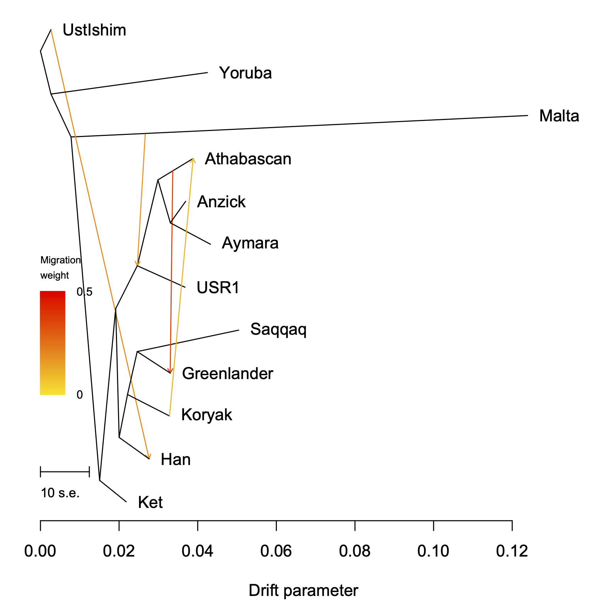
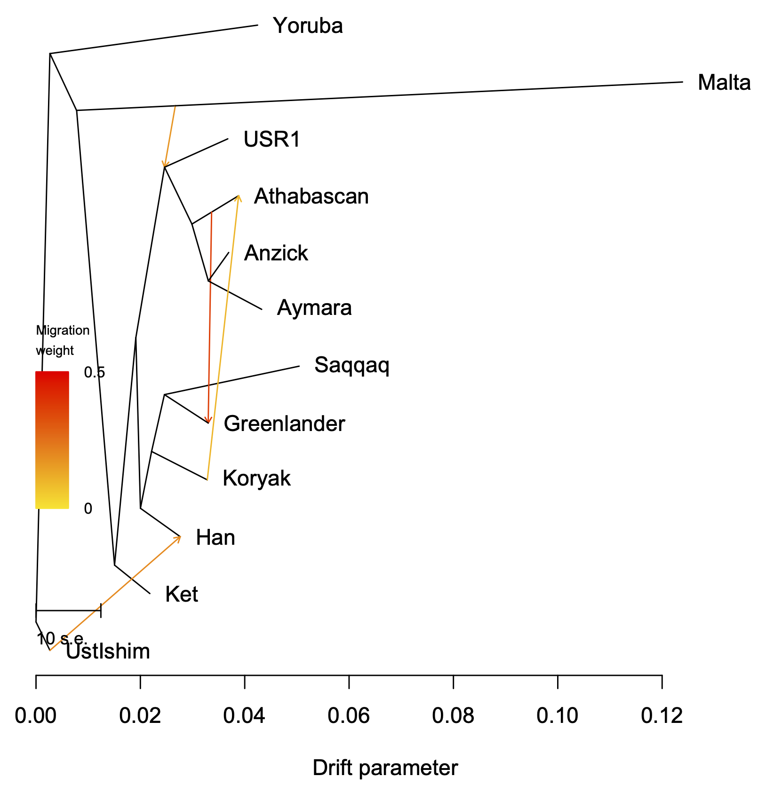

In this example, we will reanalyze the Arctic Data from [Nielsen, Vaughn, *et al.*, PLOS Genetics, 2023](https://doi.org/10.1371/journal.pgen.1010410). 


The input data `ArcticData.txt.gz` was created by gzipping [https://github.com/avaughn271/AdmixtureBayes/blob/main/Data/ArcticData.txt](https://github.com/avaughn271/AdmixtureBayes/blob/main/Data/ArcticData.txt). 


Step 1
------
The first step is to convert the allele frequencies into f2-summary statistics:
```
../../src/orientagraph \
    -i ArcticData.txt.gz \
    -root UstIshim \
    -f2 \
    -freq2stat \
    -k 5000 \
    -seed 12345 \
    -o arctic-data-k5000-seed12345
```
which can be given to OrientAGraph as input (note that you do not need to do this step but it can be helpful if you want to explore different versions of running OrientAGraph without re-estimating the f2-statistics).

Note that the author's of TreeMix recommend using a value of `-k` that far exceeds the known extent of LD in the organism in question.

Before moving on, let's check out the data. Type
```
gzcat arctic-data-k5000-seed12345.cov.gz
```
to see the matrix of f2-statistics and type 
```
gzcat arctic-data-k5000-seed12345.covse.gz
```
to see the matrix of standard errors.


Step 2: Run OrientAGraph in default mode.
-------
Let's run OrientAGraph in default mode.
```
../../src/orientagraph \
    -i arctic-data-k5000-seed12345.cov.gz \
    -givenmat arctic-data-k5000-seed12345.covse.gz \
    -root UstIshim \
    -f2 \
    -m 4 \
    -seed 12345 \
    -o orientagraph-default-arctic-data-k5000-seed12345 \
    &> orientagraph-default-arctic-data-k5000-seed12345.log
```

If you look at the log file, you will see 
```
Network search will include 4 admixture edge additions
Exhaustive search will be performed for the following admixture edge additions: 
MLNO search will be performed after each of the following admixture edge additions: 1 2 
```
This means that OrientAGraph will perform MLNO search after the first two edge additions (same as `-mlno 1,2`). The default changed starting in version 1.2; previously, you needed to use the command `-mlno` flag to perform any MLNO search. The default was changed because `-mlno 1,2` is appropriate for most users. It is may be sufficient to re-route admixture edges away from the outgroup population and it is relatively computationally efficient (even for large numbers of populations or admixture edges).


Step 2: Run OrientAGraph without MLNO search.
-------

```
../../src/orientagraph \
    -i arctic-data-k5000-seed12345.cov.gz \
    -givenmat arctic-data-k5000-seed12345.covse.gz \
    -root UstIshim \
    -f2 \
    -m 4 \
    -mlno 0 \
    -seed 12345 \
    -o orientagraph-mlno0-arctic-data-k5000-seed12345 \
    &> orientagraph-mlno0-arctic-data-k5000-seed12345.log
```

Step 3: Look at the results.
-------
First, create a poporder file for the visualization.
```
gzcat ArcticData.txt.gz | head -n1 | sed 's/ /\n/g' > poporder.txt 
```

Second, start `R`.

Third, type
```
source("../../src/plotting_funcs.R")
plot_tree("orientagraph-default-arctic-data-k5000-seed12345")
plot_resid("orientagraph-default-arctic-data-k5000-seed12345", "poporder.txt")
```
and repeat for the outputs.

<p>


<em> Left is OrientAGraph in default mode; Right is no MLNO.</em>
</p>

 


In this case, we can see that MLNO search does not improve the graph. Please keep track of this information and if you find real world examples where MLNO makes a difference, we would love to know!! Please send to ekmolloy@umd.edu

To analyze a dataset where MLNO has an impact, go to [this example](../toy-data/README.md).

