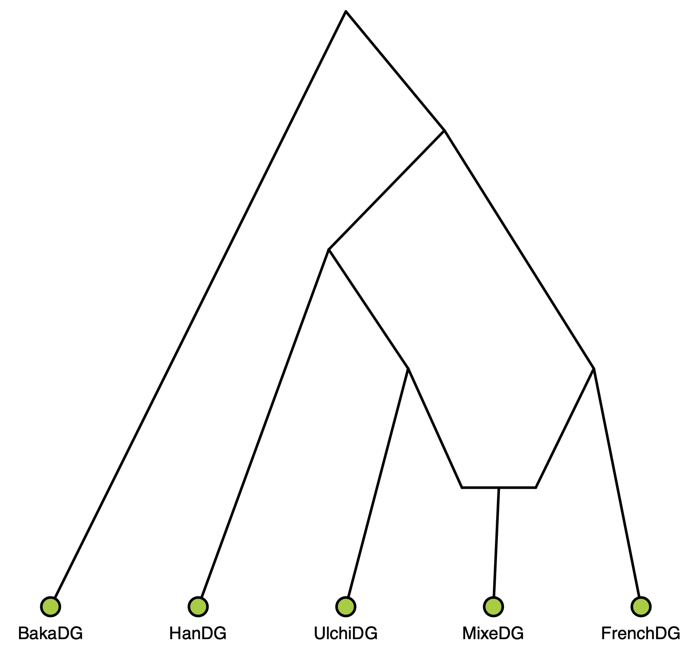
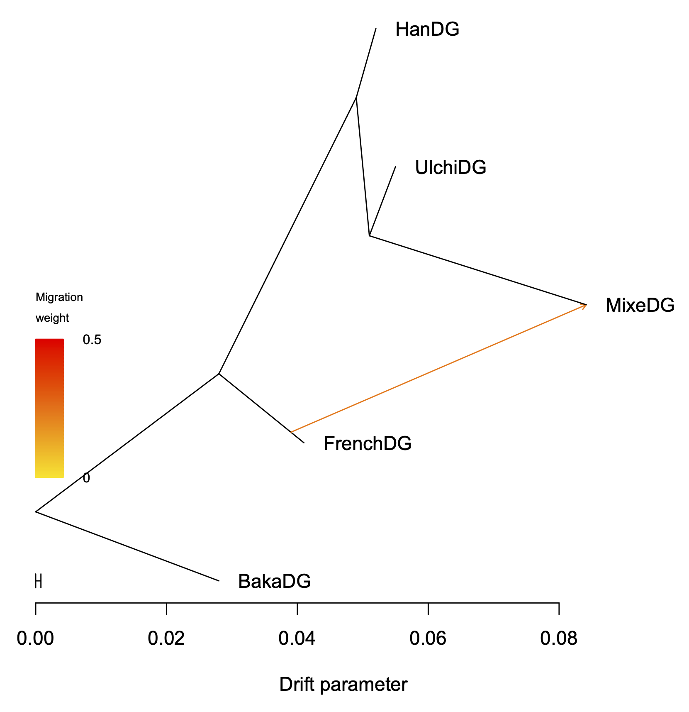
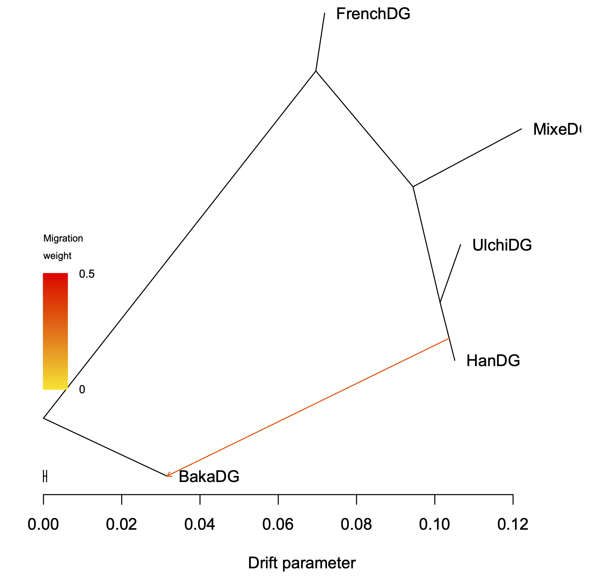

Here, we will analyze a dataset where MLNO makes a difference.


We take the model in Figure 5a of [Lipson, *Molecular Ecology Resources*, 2020](https://doi.org/10.1111/1755-0998.13230).

<p align="center">

</p>

First, we will analyze the true f2-statistics from this model using the R package [admixturegraph](https://doi.org/10.1093%2Fbioinformatics%2Fbtx048). In this case, the standard error is set to a uniform low value.


Step 2: Run OrientAGraph in default mode.
-------
Let's run OrientAGraph in default mode.
```
../../src/orientagraph \
    -i modelf2mat_lipson2020_fig5a.txt \
    -givenmat modelf2se_lipson2020_fig5a.txt \
    -f2 \
    -root BakaDG \
    -m 1 \
    -seed 12345 \
    -o orientagraph-default-lipson2020-model
```

If you look at the log file, you will see 
```
Network search will include 1 admixture edge additions
Exhaustive search will be performed for the following admixture edge additions: 
MLNO search will be performed after each of the following admixture edge additions: 1 
```
This means that OrientAGraph will perform MLNO search after the first edge addition (same as `-mlno 1`). The default changed starting in version 1.2; previously, you needed to use the command `-mlno` flag to perform any MLNO search. The default was changed because `-mlno 1,2` is appropriate for most users. It is may be sufficient to re-route admixture edges away from the outgroup population and it is relatively computationally efficient (even for large numbers of populations or admixture edges).

You can look at the output with command:
```
gzcat orientagraph-default-lipson2020-model.treeout.gz 
```
which should return
```
(((HanDG:0.00300049,(UlchiDG:0.00400103,MixeDG:0.0573728):0.00199907):0.0209997,FrenchDG:0.0130001):0.0279999,BakaDG:0.0279999);
0.23994 NA NA NA FrenchDG:0.0130001 MixeDG:0.0573728
```
Note that MixeDG is an admixed population from UlchiDG and FrenchDG, as in the image above.

You can check the likelihood of this model, with command
```
cat orientagraph-default-lipson2020-model.llik
```
which should return
```
Starting ln(likelihood) with 0 migration events: -535.753 
Exiting ln(likelihood) with 1 migration events: 82.9139
```

Step 2: Run OrientAGraph without MLNO search.
-------
Now let's run OrientAGraph without the MLNO search.

```
../../src/orientagraph \
    -i modelf2mat_lipson2020_fig5a.txt \
    -givenmat modelf2se_lipson2020_fig5a.txt \
    -f2 \
    -root BakaDG \
    -m 1 \
    -mlno 0 \
    -seed 12345 \
    -o orientagraph-mlno0-lipson2020-model
```

You can look at the output with command:
```
gzcat orientagraph-mlno0-lipson2020-model.treeout.gz
```
which should return
```
((FrenchDG:0.00224935,(MixeDG:0.0277023,(UlchiDG:0.00524008,HanDG:0.00375998):0.00692005):0.0248306):0.0695982,BakaDG:0.0695982);
0.326632 NA NA NA HanDG:0.00375998 BakaDG:0.0695982
```
Note that there is admixture going from HanDG into the outgroup BakaDG, which is incorrect based on the model from which the f2-statistics were generated.

You can check the likelihood of this model, with command
```
cat orientagraph-mlno0-lipson2020-model.llik 
```
which should return
```
Starting ln(likelihood) with 0 migration events: -535.753 
Exiting ln(likelihood) with 1 migration events: -32.606
```
This is lower than the other other graph, so MLNO helped in this example. Note that we found the same result when simultating data under this model with ms, and then giving the resulting allele frequences as input to OrientAGraph.

Step 3: Visualize the results.
-------
To visualize the residuals, you will need to create a poporder file.
```
head -n1 modelf2mat_lipson2020_fig5a.txt | sed 's/ /\n/g' > poporder.txt 
```

Then, you will need to start `R`.

The following commands can be used in R
```
source("../../src/plotting_funcs.R")
plot_tree("orientagraph-default-lipson2020-model")
plot_resid("orientagraph-default-lipson2020-model", "poporder.txt")

```
and repeated for the output without MLNO.

<p align="center">


</p>
<p align="center">
    <em> Left image is OrientAGraph in default mode (llik = 82.9139); Right image is OrientAGraph witout MLNO (llik = -32.606).</em>
</p>


If you find real world examples where MLNO makes a difference, we would love to know!! Please send a message to ekmolloy@umd.edu

